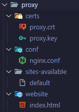

# Despliegue Proxy Inverso con Nginx
## Objetivo
El objetivo requerido es la creación de un proxy inverso apoyándonos en un servidor Nginx dentro de un contenedor Docker.  

Tendremos dos servidores web, uno Apache y otro Nginx que nos mostrarán respectivamente: un subdominio ***/apellidos***, con una web privada con nuestros apellidos y un subdominio ***/nombre***, que mostrará una web pública con nuestro nombre.  

El servidor Nginx en el ***subdominio /***, realizará las funciones de proxy inverso y redirigirá a uno u otro servidor web según la ruta. Por defecto, muestra una web que pone "Hola Mundo" y tiene dos enlaces a los subdominios anteriores: ***/nombre*** y ***/apellidos***.


## Proceso
Crearemos un directorio para cada servidor: apache, nginx y proxy. Cada uno tendrá su propia configuración y archivos web.

### 1. Configuramos el servidor Nginx del proxy

#### Fichero de configuración
 Creamos para el proxy un directorio **conf** y creamos el fichero de configuración nginx.conf. Haz click para ver su [contenido](./proxy/conf/nginx.conf).  

    


#### Seguridad

Para la parte de seguridad, resaltar que los certificados de OpenSSL van en el proxy. Para crearlos seguiremos este proceso:  

Abrimos la terminal OpenSSL y ejecutamos el siguiente comando, situados en un directorio que debemos crear con el nombre ***certs***:  
\
    ```openssl req -x509 -nodes -days 365 -newkey rsa:2048 -keyout proxy.key -out proxy.crt```  
\
    

Los ficheros generados **proxy.crt** y **proxy.key** quedan así colocados en el directorio **certs**:  

  

#### Página por defecto del proxy al solicitar https://proxy.com/

Crearemos la web que mostrará por defecto, con links a los subdominios ***german.com*** y ***fernandezcarracedo.com***. Al no tener mas que un host en este servidor, usaremos el fichero de configuración por defecto de Nginx, modificando lo que corresponda. Se situará en la carpeta ***sites-available*** y este es su [contenido](./proxy/sites-available/default).  

Después creamos la [web](./proxy/website/index.html) que mostraremos, con los dos links a los subdominios, en una carpeta llamada **website**.  

No he creado páginas de error personalizadas, pero podrían incluirse igualmente.  

Con esto quedaría configurado el proxy, y esta sería su estructura:  

  


### 2. Configuramos el servidor Nginx del dominio de nuestro nombre

Igual que en el caso del proxy, al no tener mas que un host en este servidor, usaremos el fichero de configuración por defecto de Nginx, modificando lo que corresponda. Se situará en la carpeta ***sites-available*** y este es su [contenido](./nginx/sites-available/default).

Creamos la web principal del dominio con nuestro nombre y dos páginas para personalizar errores:  

    


### 3. Configuramos el servidor Apache del dominio con nuestros apellidos

#### Configuración del host
Creamos un directorio para el servidor, que llamamos apache

De nuevo, puesto que solo habrá un host en el servidor, el fichero de configuración de host por defecto de Apache nos servirá, y lo modificaremos con los datos del dominio. Añadiremos varias páginas de error.  

Se situará en la carpeta ***sites-available*** y este es su [contenido](./apache/sites-available/000-default.conf):  

Especificamos además, que tendremos un directorio con acceso restringido, que llamaremos **privado**.

#### Web servida

Añadimos un directorio llamado **website** con las páginas que utilizará nuestro host, así como el directorio ***privado***.

#### Acceso restringido

Añadiremos el archivo [.htaccess](./apache/website/.htaccess) con la configuración de acceso.

Por último, creamos la carpeta htpasswd y añadimos el archivo ***.htpasswd*** que utilizaremos después.
    
La estructura de archivos del servidor Apache quedaría así:
    
     


### 4. Modificación del fichero .hosts

También debemos habilitar en el fichero .hosts del sistema las direcciones para nuestros hosts virtuales:

 

### 5. Fichero docker-compose

A continuación creamos el fichero docker-compose [docker-compose.yml](./docker-compose.yml) para configurar los servicios que conformarán nuestro proxy:

 

Desplegamos nuestro servidor ejecutando:  

```docker-compose up -d```


### 6. Generación del archivo .htpasswd

Entramos en el contenedor del servidor Apache, mediante:  

```docker exec -it apache_server /bin/bash```  

Dentro de la terminal del contenedor, ejecutamos el comando de Apache, situados en el directorio ***/etc/apache2***:  

```htpasswd -c /etc/apache2/.htpasswd german```  

y añadiremos los datos que nos pide: como usuario nuestro nombre y como password nuestro apellido.


El archivo .htpasswd va en el directorio htpasswd, que al mapearlo en el docker-compose.yml, quedaría en el directorio /etc/apache2/.htpasswd en el contenedor.

### 7. Prueba hosts

Una vez hecho esto, ya podemos probar nuestros hosts, escribiendo en nuestro navegador las siguientes direcciones:

- Host nombre: https://proxy.com/german

    

- Host nombre no encontrado: https://proxy.com/german/notfound

    

- Host apellidos: https://proxy.com/fernandezcarracedo

    

- Host apellido no encontrado: https://proxy.com/fernandezcarracedo/notfound

    

- Carpeta privada en seguro.net: https://proxy.com/fernandezcarracedo/privado

    
    

- Proxy página por defecto: https://proxy.com/  

    

    Desde esos enlaces podemos ir a los subdominios.


